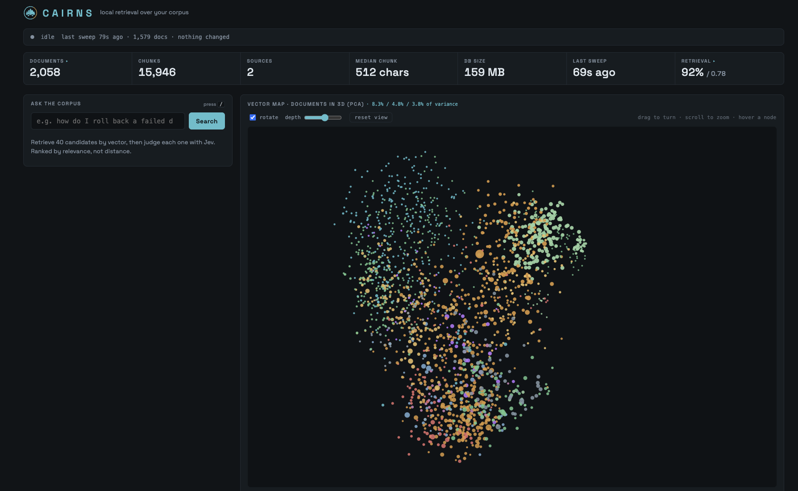

<p align="center">
  <picture>
    <source media="(prefers-color-scheme: dark)" srcset="assets/logo-dark.png">
    
  </picture>
</p>

# cairns

> *cairn* (Scottish Gaelic **càrn**): a stack of stones raised as a waymark on
> high ground, so whoever comes next can find the path.

Local semantic search over your own files. Ask a question in plain language,
get back **the documents that answer it** rather than the documents that share
its vocabulary. Nothing leaves the machine except, optionally, one reranking
call.

It speaks MCP, so a coding agent can search your notes as a tool.



The map is your corpus projected to three dimensions by PCA, so the clusters are
real: a search lights up the documents that answered it and dims the rest, which
is how you see *where* an answer lives rather than only what it says.

Or from the API, and identically through the MCP tool:

```
$ curl 'localhost:8765/api/search?q=how+do+I+roll+back+a+failed+deploy'

97%  Deployment runbook          fs:runbooks/deployments.md
     matched under: Deployments > Rolling back
     6 passages in this document matched
28%  Operator handbook           fs:ops/handbook.md

Vector search already had this first; the rerank agreed and scored it 97%.
```

## How it works

Two stages, because they are good at different things.

```
question ──▶ embed ──▶ vector search ──▶ 40 candidates ──▶ rerank ──▶ answers
              40ms         55ms           (recall)          ~1.2s     (precision)
```

**Vector search buys recall.** It finds passages that mean the same thing as
your question even when they share no words with it. It is also happy to hand
back forty things that are merely on the same topic.

**The reranker buys precision.** Each candidate is judged individually: *does
this passage answer this question?* That question has an answer; "is this
similar?" does not. Without a key this stage is skipped and the UI says so.

**It returns locators, not text.** A path or a record URL, never the passage
itself. The agent on the other end can open files, and a chunk stripped of its
heading and surrounding argument is worth less than a pointer to the whole
document.

**A low score is information.** Both the API and the MCP tool apply a relevance
floor and state plainly when nothing cleared it, because the alternative is
inferring an answer from the least-bad of a candidate set that contained none.

## Quick start

Requires Docker and [Ollama](https://ollama.com) on the host.

```sh
brew install ollama && ollama pull bge-m3

# Containers reach Ollama over the Docker gateway, which needs a 0.0.0.0 bind.
launchctl setenv OLLAMA_HOST 0.0.0.0     # macOS; see below

git clone https://github.com/arenzana/cairns && cd cairns
cp .env.example .env    # set POSTGRES_PASSWORD and FS_HOST_PATH; every
                        # setting is documented inline there
docker compose up -d
```

Then open <http://127.0.0.1:8765>. First index runs about 15 minutes for 1,500
documents; after that a sweep with nothing to do takes a second.

Ollama is deliberately **not** in Docker: Docker Desktop has no GPU passthrough,
so a containerised Ollama falls back to CPU and turns a 15-minute index into
hours. On macOS `brew services restart ollama` regenerates the launch agent and
drops `OLLAMA_HOST`; use `launchctl kickstart -k gui/$UID/sh.brew.ollama`.

### Embedding somewhere else

`OLLAMA_URL` can point at another machine, which is what makes cairns usable on
a laptop with no GPU worth the name: embed on the desktop over the tailnet
instead of spending hours on the CPU. Use the address, not the hostname, since
a container does not share the host's MagicDNS.

That machine sleeps, though, and search is useless without an embedder. So
`OLLAMA_FALLBACK_URL` names a second one, used only while the first is
unreachable, detected in five seconds and retried every minute. Unset, there is
no fallback and nothing changes. The trace names the endpoint that answered and
says plainly when it is the fallback, because the latency difference otherwise
has no visible cause.

For a host that cannot serve a native Ollama without opening a port to its own
containers, the compose file carries a CPU one, off unless asked for:

```sh
docker compose --profile local-embed up -d
docker compose exec ollama ollama pull bge-m3
echo 'OLLAMA_FALLBACK_URL=http://ollama:11434' >> .env
docker compose up -d --force-recreate cairnsd cairns-serve
```

It publishes no ports: reachable only from the compose network, so the host
neither binds `0.0.0.0` nor needs a firewall rule to let its own containers
back in. A single query embeds in about 70ms on it; a full index would take
hours, which is why it is a fallback and not the default.

### Reaching it from a phone

By default everything binds to loopback. To reach the dashboard over your
Tailscale network, set both in `.env`:

```sh
TAILNET_IP=100.x.y.z                                        # this machine's tailscale address
COMPOSE_FILE=docker-compose.yml:docker-compose.tailnet.yml
```

This *adds* a binding, so a locally registered MCP client keeps working on
`127.0.0.1`. The UI is responsive: below 760px the columns stack with search
above the map, the map shrinks to a glanceable band, and the canvas takes one
finger to turn, two to pinch-zoom and a tap to open a node, since a touch screen
has no hover and no wheel.

> [!WARNING]
> **The dashboard has no authentication.** Anything that can reach the port can
> read your entire indexed corpus. Tailscale is a private network, not an
> authenticated one, so every device on your tailnet can reach it, including
> devices belonging to accounts you have shared it with. Restrict it with a
> Tailscale ACL if that is not what you want, and never put it behind Tailscale
> Funnel, which publishes to the open internet.

### Choosing where embedding runs

Embedding is the only part that wants real hardware. Name embedders in
preference order and the local one is always appended last:

```sh
OLLAMA_URLS=http://gpu-box:11434,http://server:11434
```

Order by **fastest when awake**, not by most reliable. An unreachable endpoint
costs one 5-second dial timeout and then the next is tried, so putting a GPU box
that sleeps at the front is close to free, and the always-on machine behind it
catches everything else. Only transport failures fail over: a model or dimension
error means the same thing everywhere, so failing over would only hide it.

Inside a container, `127.0.0.1` is the container, so `OLLAMA_LOCAL_URL` sets what
"local" means there (compose already points it at `host.docker.internal`).

### Register it with an agent

```sh
claude mcp add --scope local --transport http cairns http://127.0.0.1:8765/mcp
```

One tool, `search_notes`, returning paths for the agent to open.

## Sources

The filesystem source is compiled in and always on. Everything else is a plugin,
registered the way `database/sql` drivers are:

```go
// cmd/cairnsd/main.go
import (
    _ "github.com/arenzana/cairns/internal/source/fs"
    _ "github.com/arenzana/cairns/internal/source/twenty"  // delete this line and it's gone
)
```

| source | default | configured by |
|---|---|---|
| `fs` | **on** | `FS_HOST_PATH`, optional `OBSIDIAN_VAULT` for `obsidian://` links |
| `twenty` | off | `TWENTY_BASE_URL` + `TWENTY_API_KEY` |

An unconfigured plugin is skipped and named in the startup log, never fatal. A
plugin that *is* configured and fails to build is fatal, because you meant it.

### Writing one

Three methods, about a hundred lines. **[docs/SOURCES.md](docs/SOURCES.md)** has
the contract, a complete worked source you can copy, and the invariants that
matter, each with what breaking it actually does to your index.

```go
Name() string                              // goes in documents.source, prefixes every locator
List(ctx) ([]source.Ref, error)            // id + the SOURCE's updated_at
Fetch(ctx, Ref) (source.Doc, error)
URI(Ref) string                            // a locator the agent can dereference
```

Then `source.Register("yours", factory)` in an `init()` and one blank import.
Nothing in the indexer changes.

Prove it obeys the contract with one test:

```go
func TestContract(t *testing.T) { sourcetest.Contract(t, mysource.New(...)) }
```

`internal/source/sourcetest` checks what the signatures cannot: that `List` is
idempotent, that `UpdatedAt` is the origin's own timestamp (a zero value quietly
re-embeds your entire corpus every sweep), that `URI` is stable and prefixed,
that `Fetch` errors on an unknown id instead of indexing an empty document.

### Steering what a document matches

An embedding is a pure function of the text you feed the model. The model is
frozen, so the only way to move a document through the vector space is to change
what gets embedded. The filesystem source reads an optional `about:` from YAML
frontmatter and folds it into every chunk of that document:

```markdown
---
title: Move to Spain
about: Relocating from the US to Madrid. Visas, shipping, schools, the dog.
---

- [[Fito]]
- Woof Airlines
- Bring person
```

This exists for notes that are checklists, link lists or bullet fragments. The
training pairs behind embedding models are overwhelmingly prose, so a note like
the one above carries almost no embeddable meaning and is invisible to semantic
search no matter how it is chunked. Measured on exactly that note, one line of
`about:` moved it from 0.410 to **0.309** cosine distance for *what do I need to
do to move to Madrid*, and it also got closer to *relocation checklist*, a query
sharing no words with the hint.

Editing frontmatter changes the file, so the content hash changes and the next
sweep re-embeds that document by itself. No `-reindex`, no restart.

**Use it sparingly.** Needing it on many documents means the chunker or the
retrieval mix is wrong, and hand-annotating notes is papering over that. A
handful is maintenance; fifty is a symptom.

<details>
<summary>Why not hybrid keyword search instead?</summary>

The obvious alternative is blending BM25 with vector similarity, and this schema
has a populated, GIN-indexed `tsv` column ready for it. It was measured and
rejected: Postgres full-text ranking is **not** BM25. `ts_rank_cd` has no IDF
term, so with the `simple` config (required, because the corpus is multilingual
and `english` would mangle Spanish) the word `to` appears in 50.9% of chunks and
counts as much as `spain` at 4.7%. It has no real length normalisation either,
so a short note mentioning a term once loses to a long list mentioning it twenty
times. Across every `ts_rank` normalisation flag, the target note ranked between
70th and 505th lexically, against a 40-document candidate window. No mixing
weight rescues that.

Real hybrid retrieval here needs a real BM25, which means a Postgres extension
such as ParadeDB `pg_search` or VectorChord-bm25. Worth it if a whole class of
queries is blind to the embedder; not worth it for a handful of notes.
</details>

### Watching it work

The dashboard shows searches as they happen, from both surfaces. Most traffic
arrives over MCP from an agent, which is otherwise the busiest user of the
system and completely invisible: no way to see what was asked, whether it found
anything, or what it cost.

Three states are distinguished because they mean different things: still
running, finished with an answer, and finished with **nothing above the
threshold**. The third is not a failure, but it is the one worth noticing.

Results carry thumbs. A vote is **not a ranking input**, it is an eval label:
up becomes `expect_any`, down becomes `reject`. A handful of votes cannot steer
a model without overfitting to those exact votes, but they can build the golden
set that nobody ever sits down to write. `GET /api/feedback` returns them
already shaped like `labels.json`, so promoting one is a copy rather than a
translation.

## Measuring it

Retrieval quality is not eyeballable. `cairns-eval` runs a labelled set and
reports recall, MRR and reject-violations:

```sh
cp eval/labels.example.json eval/labels.json   # then write your own questions
go build -o bin/cairns-eval ./cmd/cairns-eval && ./bin/cairns-eval -v
```

The dashboard shows the last run under **retrieval**; it reports the eval and
never triggers one, since a run costs real tokens.

This is not ceremony. A single-statement candidate query in an early version
applied its `LIMIT` to rows ordered by document id rather than by distance, so
the candidate set was the 400 lowest ids. Recall was 42% while vector search was
ranking the right answer **first**. Nothing about the results looked wrong. The
eval found it; fixing it took recall to 92% and MRR from 0.333 to 0.792.

Note the floor on what a small set can tell you: with twelve cases, one case is
worth 0.042 of MRR, so a move under ~0.05 is noise. Trust recall and
reject-violations, and diff two runs to name the case that changed before
calling anything a regression.

## Notes on the build

- **There is no vector index, on purpose.** Measured at 15,910 chunks: an exact
  scan takes 56ms and yields 172 candidate documents; a forced HNSW scan takes
  46ms and yields 154. Ten milliseconds on a stage worth ~5% of the wall clock,
  paid for with 18 fewer candidates and 156MB of index. Rebuild it around 100k
  chunks, and re-run the eval, because it makes retrieval approximate.
- **The rerank is ~87% of a search.** It is the only stage worth optimising.
- **Two embed workers.** bge-m3 saturates an M1 Max at 9-11 chunks/sec; 2/4/8
  workers gave 10.7, 9.0 and 9.4. More concurrency does not help.

## Privacy

Postgres and the dashboard bind to loopback only. The indexed directory is
mounted read-only. The UI font is served from the binary rather than a CDN,
because a webfont request still reports when someone opened a tool pointed at
their own notes.

The single exception is the reranker, which sends the question and the candidate
passages to [TypeSafe](https://typesafe.ai). Leave `TYPESAFE_API_KEY` unset and
nothing leaves the machine at all; search falls back to vector similarity and
labels itself as unjudged.

## Licence

MIT, see [LICENSE](LICENSE). The bundled UI font is Space Grotesk under the SIL
Open Font License, see [fonts/](fonts/).
